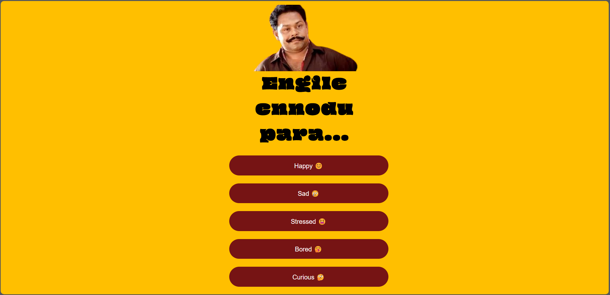
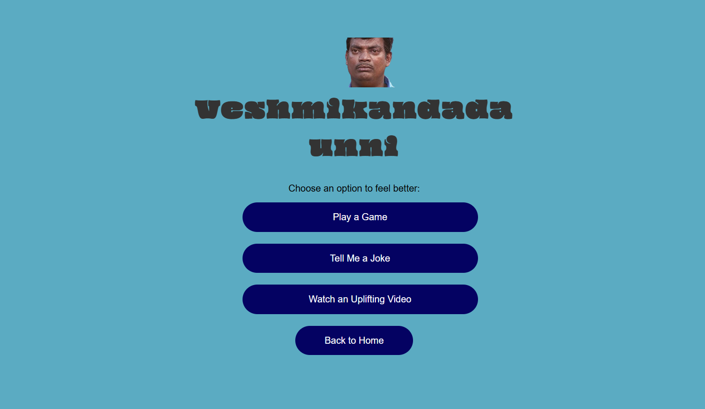
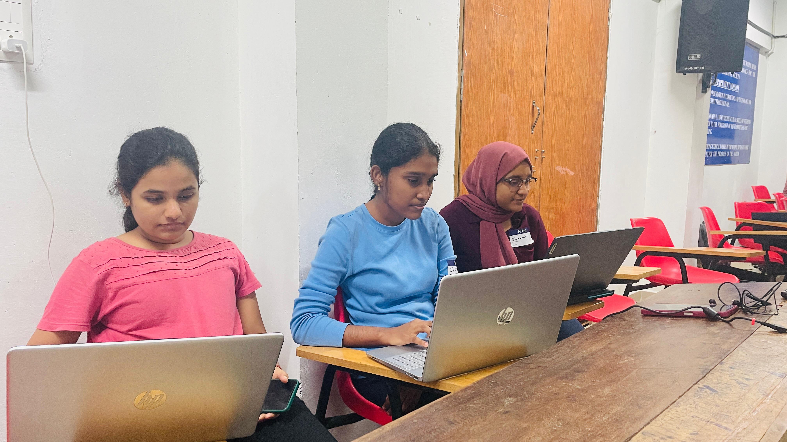

# MOODESH 🎯

## Basic Details

**Team Name**:  MJeN 
 

**Team Members** 
- **Member 1**: Jyothsna Treesa George - Rajiv Gandhi Institute of Technology,Kottayam
- **Member 2**: Nazmin Babu Baker - Rajiv Gandhi Institute of Technology,Kottayam
- **Member 3**:  Merin Mathew - Rajiv Gandhi Institute of Technology,Kottayam \
**Hosted Project Link**  
  [https://nazmin-babubaker.github.io/Moodesh/]

---

## Project Description  
Moodesh is an interactive website that helps users improve their mood by providing personalized tasks based on their emotional state. The site features a mood selector that directs users to engaging activities tailored to their current feelings.

---

## The Problem Statement  
In a fast-paced world, emotions often take a backseat. We all face stress, boredom, loneliness, and other mood swings that impact our mental health. What if you could get an instant pick-me-up with just one click?

---

## The Solution  
Moodesh offers a fun, simple way to manage your emotions. Based on your selected mood, the website suggests activities ranging from playing games to engaging in mindfulness exercises. It’s like having a virtual cheerleader in your pocket!

---

## Technical Details

### Technologies/Components Used

#### For Software:
- **Languages Used**: HTML, CSS, JavaScript  
- **Frameworks Used**: None (pure HTML, CSS, and JS)  
- **Libraries Used**: jQuery (optional for enhanced interactivity)  
- **Tools Used**: VS Code, Git, GitHub

#### For Hardware:
- Not applicable (this is a web project)

---

## Implementation

### For Software:

#### Installation
- Clone the repository:  
  `git clone <repo-link>`

#### Run
- Open `index.html` in your browser or use the VS Code Live Server extension for real-time updates.

---

## Project Documentation

### For Software:

#### Screenshots  
  
*This shows the homepage where the user selects their mood.*

  
*This is the mood page for the 'Sad' mood with a list of cheerful tasks.*

## Build Photos  
  
*Our amazing team working hard on the Moodesh webpage/*

## Project Demo  
**Video**  
[(https://github.com/Nazmin-Babubaker/Moodesh/blob/main/video.mp4)]  
*This video shows how the website works, demonstrating user interactions and the mood-to-task flow.

## Team Contributions  
Nazmin Babu Baker(Lead Coder):
1.Developed the idea of mood tracker.
2.Contributed to the sad mood and main page in the project and worked on debugging. \

Merin Mathew(Sub Coder)
1.Contibuted to coding the Stressed and the Curious mood in the project.
2.Contibuted significantly to documentation of the project. \

Jyothsna Treesa George(Sub Coder)
1.Did all the research and provided most of the resources.
2.Contibuted to coding the Happy and Bored mood in the project. \

